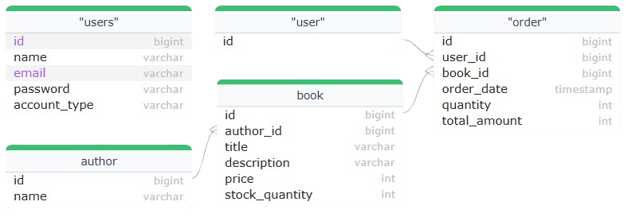
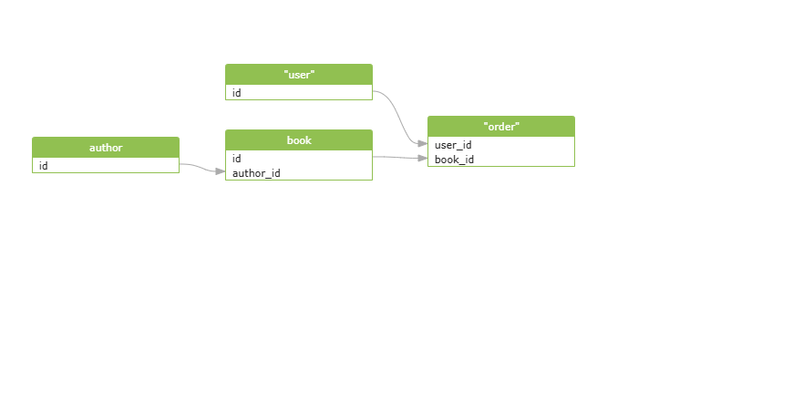

# Database Documentation

## Overview

This documentation provides details about the database schema, including the Entity-Relationship Diagram (ERD) and Relational Model. It serves as a reference for developers and analysts working with the database.

---

## Entity-Relationship Diagram (ERD)

The ERD provides a high-level visual representation of the entities, their attributes, and the relationships between them. Each entity is represented as a rectangle, with lines indicating relationships.

---

## Relational Model

The Relational Model provides a detailed view of the database schema, including tables, primary keys, foreign keys, and constraints.

---

## Table Descriptions

### Table: `author`

| Column Name | Data Type     | Constraints  | Description                          |
|-------------|---------------|--------------|--------------------------------------|
| `id`        | BIGINT        | PK, NOT NULL | Unique identifier for each author.   |
| `name`      | VARCHAR(255)  | NOT NULL     | Name of the author.                  |

### Table: `book`

| Column Name       | Data Type     | Constraints         | Description                                |
|-------------------|---------------|---------------------|--------------------------------------------|
| `id`              | BIGINT        | PK, NOT NULL        | Unique identifier for each book.           |
| `author_id`       | BIGINT        | FK, NOT NULL        | References `author(id)`.                   |
| `title`           | VARCHAR(255)  | NOT NULL            | Title of the book.                         |
| `description`     | VARCHAR(255)  | NOT NULL            | Brief description of the book.             |
| `price`           | INT           | NOT NULL            | Price of the book.                         |
| `stock_quantity`  | INT           | NOT NULL            | Available quantity in stock.               |

### Table: `users`

| Column Name   | Data Type     | Constraints               | Description                            |
|---------------|---------------|---------------------------|----------------------------------------|
| `id`          | BIGINT        | PK, NOT NULL              | Unique identifier for each user.       |
| `name`        | VARCHAR(255)  | NOT NULL                  | Name of the user.                      |
| `email`       | VARCHAR(255)  | UNIQUE, NOT NULL          | Email address of the user.             |
| `password`    | VARCHAR(255)  | UNIQUE, NOT NULL          | Encrypted password of the user.        |
| `account_type`| VARCHAR(10)   | CHECK (ADMIN, USER)       | Type of user account (ADMIN or USER).  |

### Table: `order`

| Column Name    | Data Type     | Constraints               | Description                                    |
|----------------|---------------|---------------------------|------------------------------------------------|
| `id`           | BIGINT        | PK, NOT NULL              | Unique identifier for each order.             |
| `user_id`      | BIGINT        | FK, NOT NULL              | References `users(id)`; deleted on cascade.   |
| `book_id`      | BIGINT        | FK, NOT NULL              | References `book(id)`; deleted on cascade.    |
| `order_date`   | TIMESTAMP     | NOT NULL                  | Date and time of the order.                   |
| `quantity`     | INT           | NOT NULL                  | Quantity of books ordered.                    |
| `total_amount` | INT           | NOT NULL                  | Total amount for the order.                   |

### Relationships:

- `book.author_id` references `author.id`.
- `order.user_id` references `users.id` (ON DELETE CASCADE).
- `order.book_id` references `book.id` (ON DELETE CASCADE).
